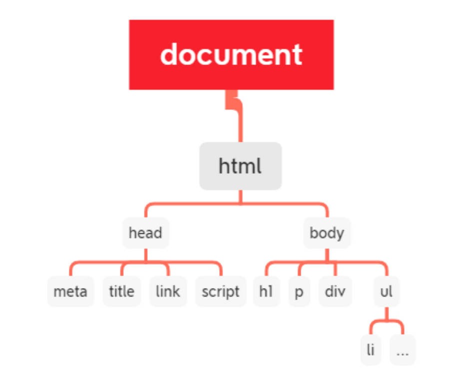

# DOM的节点层次

**$\color{green}{DOM的节点层次}$**

在我们加载HTML⻚⾯时，浏览器会⽣成⼀个树型结构，⽤来表⽰⻚⾯内部的结构内容。

DOM把这种树型结构理解成为节点（元素，标签）组成。

**$\color{orange}{1.1.节点层次的介绍:}$**

DOM 可以将任何 HTML 或 XML 文档描绘成一个由多层节点构成的结构。
节点分为几种不同的类型，每种类型分别表示文档中不同的信息及（或）标记。*
每个节点都拥有各自的特点、数据和方法，另外，也与其他节点存在某种关系。
节点之间的关系构成了层次，而所有页面标记则表现为一个以特定节点为根节点的树形结构。

**$\color{orange}{1.2.节点层次的结构:}$**

以下面的 HTML 为例：

``` html
    <html lang="en">
        <head>
            <meta charset="UTF-8">
            <meta name="viewport" content="width=device-width, initial-scale=1.0">
            <title>Document</title>
            <style></style>
            <script><script>
            <link rel="stylesheet" href="">
        </head>
        <body>
            <h1></h1>
            <p></p>
            <div></div>
            <ul>
                <li></li>
            </ul>
        </body>
    </html>
```

**上述的HTML文档表⽰为⼀个层次结构。**

下图表⽰上⾯内容的节点树:



- 文档节点是每个文档的根节点。
- 在这个例子中，文档节点只有一个子节点，即html元素，我们称之为文档元素。
- 在 HTML 页面中，文档元素始终都是html元素。
